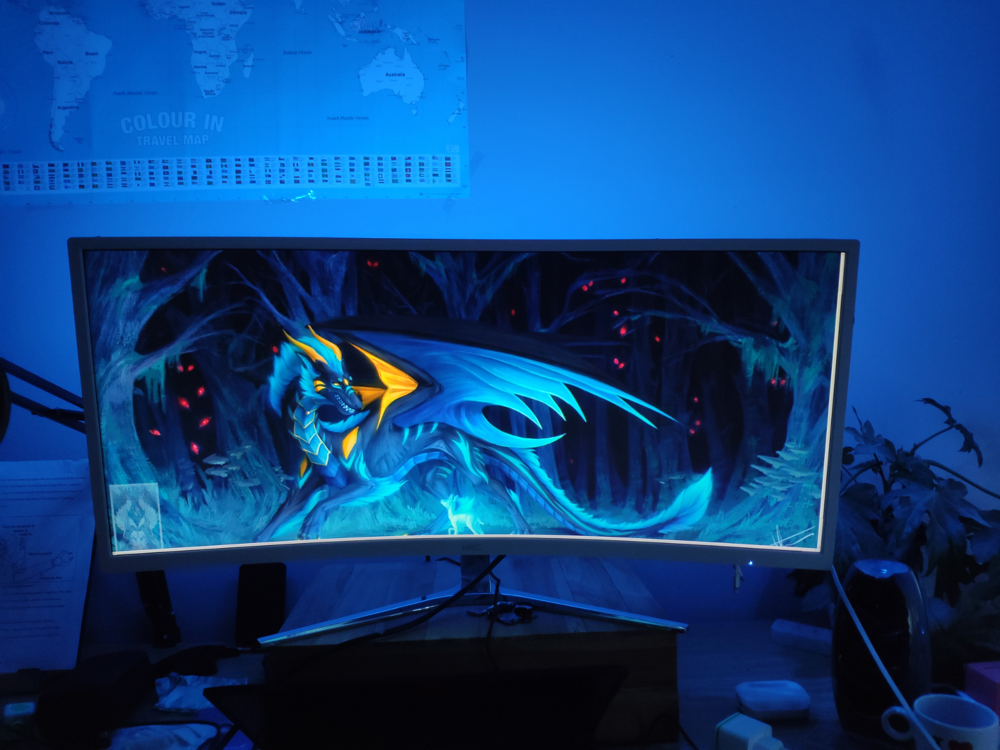
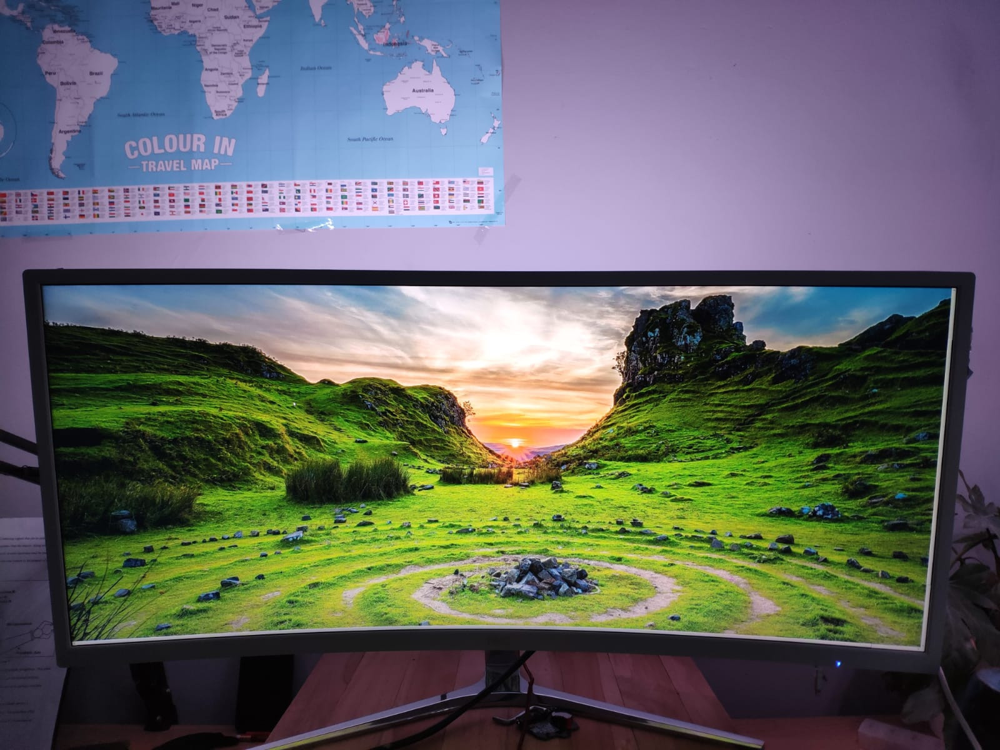

# Hodini

A DIY project using WS2812B led strips in combination with a ESP8266 and a custom driver (Linux only so far) that changes the led's color to the average color of your screen.

The driver is *very fast*, uses an optimized algorithm that is light on the CPU and RAM so your games remain smooth.

# How to build

TODO...

# Examples

